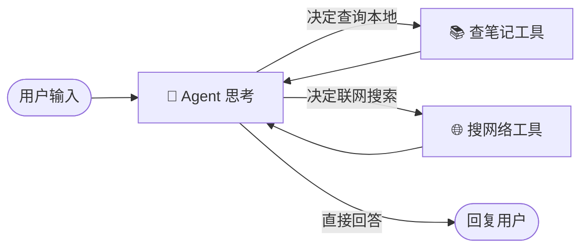

# 🤖 AgentLearn: 从零打造个人智能笔记助理

> 这是一个记录从零开始学习 AI Agent 开发的实战项目。
> 目标：打造一个能够理解中文、自动同步本地笔记、具备联网能力的智能个人助理。

## 📖 项目简介

本项目旨在通过构建一个实际可用的“个人笔记助理”，深入理解 **LLM (大语言模型)**、**RAG (检索增强生成)** 和 **Agent (智能体)** 的核心原理。

它不仅仅是一个聊天机器人，它拥有“眼睛”（读取本地文件）、“记忆”（向量数据库）和“手”（工具调用），能够帮助你管理繁杂的 Markdown 个人笔记。

## 🏗️ 技术架构

本项目采用了目前最前沿的 AI 技术栈：

*   **大脑 (LLM)**: [DeepSeek-V3](https://www.deepseek.com/) (通过 OpenAI 兼容接口调用)
*   **编排 (Orchestration)**: [LangGraph](https://langchain-ai.github.io/langgraph/) (基于图的状态机，实现多步推理)
*   **框架 (Framework)**: [LangChain](https://www.langchain.com/)
*   **记忆 (RAG)**: [FAISS](https://github.com/facebookresearch/faiss) (向量数据库) + [HuggingFace Embeddings](https://huggingface.co/shibing624/text2vec-base-chinese) (中文专用模型)
*   **感知 (File Sync)**: 自研增量更新算法 (基于 MD5 文件指纹)

### 工作流原理 (LangGraph)



## ✨ 核心特性

1.  **🧠 强大的中文理解**
    *   集成 `text2vec-base-chinese` 模型，彻底解决英文模型对中文语义（如“OA账号”、“WiFi密码”）理解偏差的问题。

2.  **🔄 智能增量同步 (Auto-Sync)**
    *   **自动感知**: 每次启动自动扫描 `data/` 目录。
    *   **极速响应**: 文件无变动时 0 秒加载；仅对新增/修改/删除的文件进行索引重建。

3.  **🕵️‍♂️ 隐私优先的 RAG**
    *   所有笔记仅在本地进行向量化处理，隐私数据（如密码、日记）不需要上传到第三方向量云。

4.  **🛠️ 智能工具调用**
    *   模型会根据问题自动判断是查本地笔记，还是去联网搜索（目前为模拟联网）。

## 🚀 快速开始

### 1. 环境准备
*   Windows / macOS / Linux
*   Python 3.10+
*   [DeepSeek API Key](https://platform.deepseek.com/)

### 2. 安装依赖
```bash
# 推荐创建虚拟环境
python -m venv .venv
# Windows 激活
.venv\Scripts\activate

# 安装依赖
pip install -r requirements.txt
```

### 3. 配置密钥
复制 `.env.example` (如果没有则新建) 为 `.env`，并填入你的 Key：
```ini
DEEPSEEK_API_KEY=sk-xxxxxxxxxxxxxxxxxxxxxxxx
DEEPSEEK_BASE_URL=https://api.deepseek.com
```

### 4. 准备数据
在 `data/` 目录下放入你的 Markdown (`.md`) 或 Text (`.txt`) 笔记文件。
*   支持子目录递归扫描。
*   系统会自动处理编码（UTF-8/GBK）。

### 5. 运行助理
```bash
python main.py
```

## 📂 项目结构

```
AgentLearn/
├── data/                 # 存放你的个人笔记 (Markdown/Txt)
├── faiss_index/          # 自动生成的向量索引数据库
├── .env                  # 环境变量 (API Key)
├── main.py               # 🚀 主程序入口 (LangGraph 编排)
├── rag_engine.py         # 🧠 核心引擎 (RAG, 增量更新, 向量化)
├── debug_rag.py          # 🔧 调试工具 (排查检索问题)
├── requirements.txt      # 依赖列表
└── README.md             # 说明文档
```

## 🗺️ 未来路线图 (Roadmap)

- [x] **基础 RAG**: 实现本地文档问答
- [x] **Agent 架构**: 从 Chain 升级为 LangGraph
- [x] **中文优化**: 更换 Embedding 模型
- [x] **增量更新**: 实现文件指纹检测
- [ ] **真实联网**: 接入 Tavily/SerpApi 实现真正的 Google 搜索
- [ ] **多格式支持**: 支持 PDF, Word, Excel 文档
- [ ] **Web 界面**: 开发 Streamlit/Gradio 网页版 UI
- [ ] **长期记忆**: 引入 SQLite 存储历史对话摘要

## 📝 学习笔记
本项目不仅是代码，更是一份学习记录。我们在开发过程中解决了以下关键问题：
1.  **DeepSeek 工具调用**: 解决了模型“猜测”工具名的问题。
2.  **Windows 编码陷阱**: 实现了 UTF-8/GBK 自动兼容加载器。
3.  **HuggingFace 连通性**: 内置了国内镜像源配置。

---
*Created by Vinícius & Trae AI Pair Programmer*
